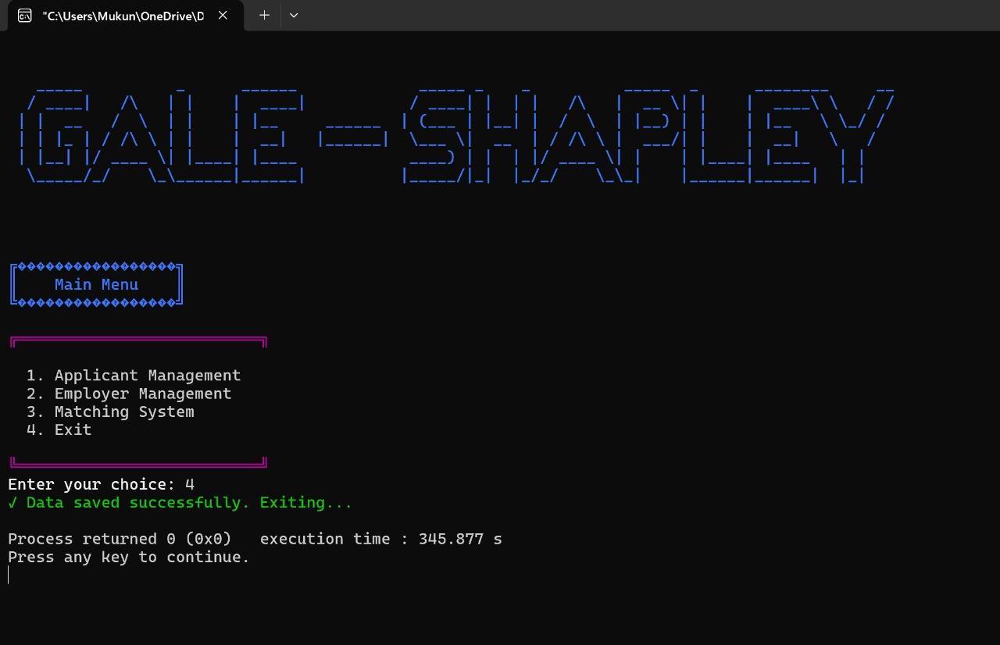
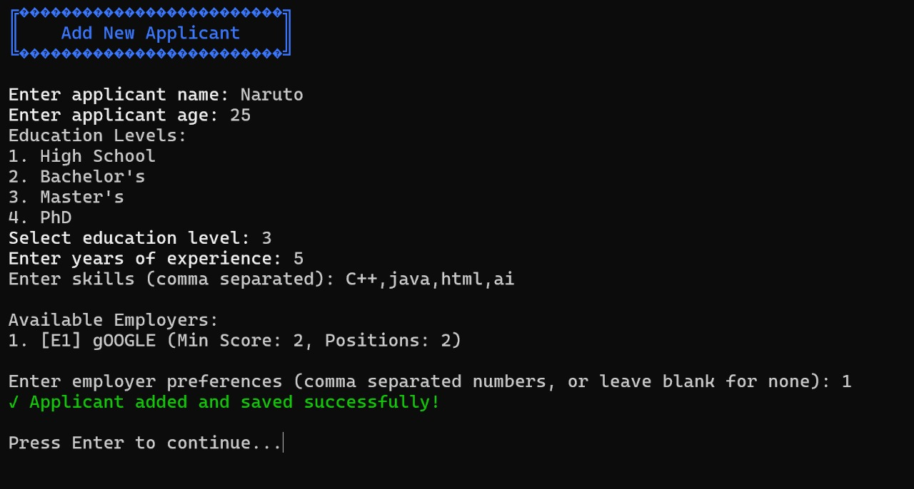
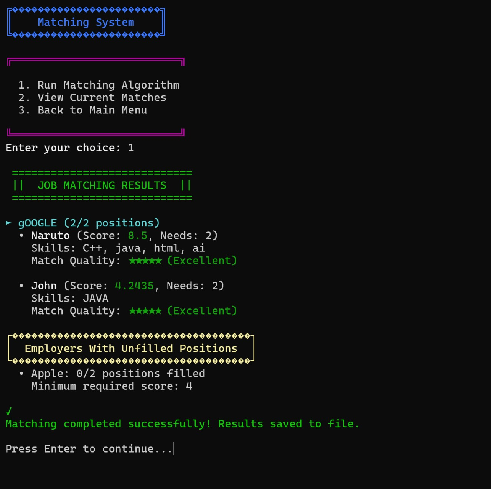

# 🌪️ Project Gale

**Project Gale** is a C++ implementation of the **Gale–Shapley Algorithm** (Stable Marriage Problem) designed for matching applicants and employers based on their mutual preferences. This console-based application provides a simple and interactive way to explore stable matching logic in action.

---

## 🚀 Features

- ➕ Add and manage applicant and employer details
- ♻️ Run the Gale-Shapley algorithm for stable matching
- 📋 View final match results with styled output
- 💾 Store and load input/output data via `.txt` files
- 🧩 Modular structure with header/source separation
- 🎨 Stylish console output using color, formatting, and ASCII art

---

## 🧠 Algorithm

Project Gale uses the **Gale-Shapley Algorithm**, also known as the **Deferred Acceptance Algorithm**, which guarantees a **stable matching** — where no applicant-employer pair would prefer each other over their assigned matches.

---

## 📂 Folder Structure

```

project-gale/
│
├── include/             # Header files (class declarations)
│   ├── applicant.h
│   ├── employer.h
│   ├── matching.h
│   ├── menu.h
│   └── utils.h
│
├── src/                 # Source files (logic implementations)
│   ├── applicant.cpp
│   ├── employer.cpp
│   ├── matching.cpp
│   ├── menu.cpp
│   └── utils.cpp
│
├── data/                # Input/output files
│   ├── applicants.txt
│   ├── employers.txt
│   └── matches.txt
│
├── screenshots/         # Images used in README
│   ├── main-menu.jpg
│   ├── applicant.jpg
│   └── matching-system.jpg
│
├── main.cpp             # Entry point
├── .gitignore           # Ignore rules
└── README.md            # Project documentation

````

---

## 🛠️ How to Build & Run

### 📦 Build (Linux/macOS)
```bash
g++ -std=c++20 -Iinclude src/*.cpp main.cpp -o project-gale
````

### 📦 Build (Windows - MinGW)

```bash
g++ -std=c++20 -Iinclude src/*.cpp main.cpp -o project-gale.exe
```

### ▶️ Run

```bash
./project-gale   # Or project-gale.exe on Windows
```

---

## 📸 Screenshots

### 🧭 Main Menu



### ✍️ Applicant Entry



### 🔁 Matching System



---

## 📜 License

This project is licensed under the [MIT License](LICENSE).
You're free to use, modify, and distribute this project for any purpose — personal or educational.

---

## 🤝 Contributions

Pull requests, bug reports, and feature suggestions are welcome!

> This is a learning-oriented project — let’s grow and improve it together 💡

---

## 💬 Questions?

Feel free to open an [Issue](https://github.com/gauravslnk/project-gale/issues) or reach out!

